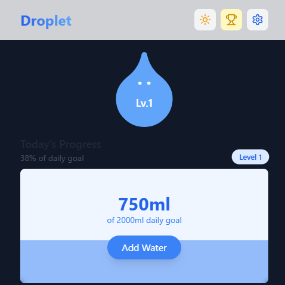

# Droplet - Water Tracking App 💧

A beautiful, gamified water tracking application built with React, TypeScript, and Tailwind CSS. Stay hydrated with personalized reminders, track your daily water intake, and watch your water companion grow as you maintain healthy hydration habits.

![Droplet Preview]


🚀 **Live Preview:** [Click to Try Droplet](https://amazing-alfajores-61b61e.netlify.app/)


## ✨ Features

- **Smart Water Tracking**: Easily log your water intake with quick-add buttons
- **Gamification**: Level up your water companion as you stay hydrated
- **Personalized Reminders**: Smart notification system that adapts to your drinking patterns
- **Progress Visualization**: Beautiful, animated progress indicators
- **Dark Mode**: Seamless light/dark theme switching
- **Persistent Storage**: Local storage integration to keep your data safe
- **Responsive Design**: Works beautifully on all devices
- **Progressive Web App (PWA)**: Install and use like a native app

## 🚀 Tech Stack

  

- **Frontend**: React 18 with TypeScript
- **State Management**: Zustand
- **Styling**: Tailwind CSS
- **Animations**: Framer Motion
- **Icons**: Lucide React
- **Notifications**: React Hot Toast
- **Build Tool**: Vite

## 🌎 Screenshots

| Light Mode | Dark Mode |
|------------|------------|
|  |  |


## 📚 Installation

1. Clone the repository:
   ```bash
   git clone https://github.com/yourusername/droplet.git
   cd droplet
   ```
2. Install dependencies:
   ```bash
   npm install
   ```
3. Start the development server:
   ```bash
   npm run dev
   ```

## 🛠️ Development

- **Development Mode**:
  ```bash
  npm run dev
  ```
- **Build for Production**:
  ```bash
  npm run build
  ```
- **Preview Production Build**:
  ```bash
  npm run preview
  ```
- **Lint Code**:
  ```bash
  npm run lint
  ```

## 🏰 Project Structure

```
droplet/
├── src/
│   ├── components/     # React components
│   ├── store/         # Zustand store configurations
│   ├── types/         # TypeScript type definitions
│   ├── App.tsx        # Main application component
│   └── main.tsx       # Application entry point
├── public/            # Static assets
└── package.json       # Project dependencies and scripts
```

## 🎯 Core Features Explained

### Water Tracking
- Track daily water intake with customizable amounts
- Visual feedback on progress
- Smart reminders based on drinking patterns

### Gamification System
- Water companion that grows with your hydration habits
- Level-up system based on consistency
- Different moods reflecting your hydration status

### Reminder System
- Customizable reminder intervals
- Smart notifications based on your schedule
- Ability to set active hours

### Settings Management
- Customize daily water goals
- Adjust reminder preferences
- Toggle dark/light mode

## 📱 How to Install as a PWA

Droplet is designed as a **Progressive Web App (PWA)**, allowing you to use it like a native app:

- **On Mobile**:
  1. Open the website in Chrome/Safari.
  2. Tap the "Add to Home Screen" option.
  3. Enjoy using it as a standalone app!

- **On Desktop**:
  1. Open the website in Chrome.
  2. Click the install button in the address bar.
  3. Launch from your applications menu!

## 🤝 Contributing

Contributions are welcome! Please follow these steps:

1. Fork the repository
2. Create your feature branch (`git checkout -b feature/AmazingFeature`)
3. Commit your changes (`git commit -m 'Add some AmazingFeature'`)
4. Push to the branch (`git push origin feature/AmazingFeature`)
5. Open a Pull Request

For guidelines, see [CONTRIBUTING.md](CONTRIBUTING.md).

## 📜 Issue Tracking

- **Report bugs**: Use [GitHub Issues](https://github.com/yourusername/droplet/issues)
- **Suggest features**: Start a discussion in [GitHub Discussions](https://github.com/yourusername/droplet/discussions)

## 📄 License

This project is licensed under the MIT License - see the [LICENSE](LICENSE) file for details.

## 🙏 Acknowledgments

- Icons by [Lucide](https://lucide.dev)
- UI inspiration from various hydration apps
- Community feedback and contributions

---

Made with 💙 by Abby,stay hydrated

